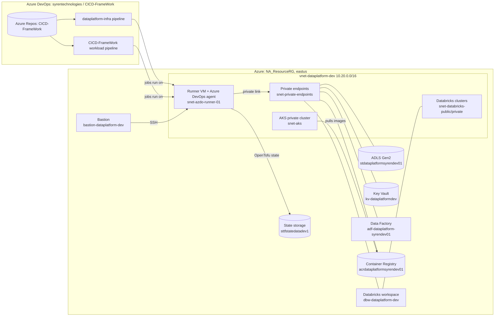

# Plug-and-Play Azure Data Platform CI/CD Framework (Dev)

This repository builds and runs a private Azure data platform for **one environment: `dev`**, and
deploys workloads onto it through **Azure DevOps**. It contains the infrastructure code (OpenTofu),
two Azure DevOps pipelines, the deployment scripts, sample workloads (ADF, Databricks, a web page on
AKS), and hello-world smoke tests that prove every component actually works after each deployment.

This README explains **what** exists, **why** it was built that way, **how** to set it up from zero,
and **how** to operate it day to day. Every manual step that is not (yet) automated is listed in
[Section 9](#9-manual-configuration-that-lives-outside-the-code) so nothing is hidden.

> **Scope.** Dev only. Subscription `SyrenPAYGSubscription`, resource group `NA_ResourceRG`,
> region `eastus`. Production would need its own environment folder, state key, service connection,
> variable groups and approvals.

---

## Contents

1. [Architecture at a glance](#1-architecture-at-a-glance)
2. [Repository layout](#2-repository-layout)
3. [Azure resources and naming](#3-azure-resources-and-naming)
4. [Key design decisions (and why)](#4-key-design-decisions-and-why)
5. [Identities and permissions](#5-identities-and-permissions)
6. [The two pipelines](#6-the-two-pipelines)
7. [Hello-world smoke tests](#7-hello-world-smoke-tests)
8. [Azure DevOps configuration](#8-azure-devops-configuration)
9. [Manual configuration that lives outside the code](#9-manual-configuration-that-lives-outside-the-code)
10. [Setting up from zero](#10-setting-up-from-zero)
11. [Day-to-day operations](#11-day-to-day-operations)
12. [Troubleshooting (real errors we hit and their fixes)](#12-troubleshooting-real-errors-we-hit-and-their-fixes)
13. [Security notes and accepted risks](#13-security-notes-and-accepted-risks)
14. [Known gaps and next steps](#14-known-gaps-and-next-steps)
15. [Automation roadmap: turning the manual steps into code](#15-automation-roadmap-turning-the-manual-steps-into-code)
16. [Reference: names and IDs](#16-reference-names-and-ids)

---

## 1. Architecture at a glance



**How it fits together**

- **Everything data-bearing is private.** Storage, Key Vault, ACR, Data Factory and the Databricks
  workspace have private endpoints inside the VNet, and storage/Key Vault/ACR/ADF have public
  network access disabled. Traffic stays on the Azure backbone.
- **All pipeline jobs run on one self-hosted agent VM inside the VNet.** Microsoft-hosted agents
  run on the internet and could not reach private endpoints. The VM can.
- **Two pipelines, one repository.** `dataplatform-infra` changes infrastructure (plan, human
  review, apply). The workload pipeline (`CICD-FrameWork`) builds, scans, deploys and tests
  workloads, and never changes infrastructure.
- **No secrets for Azure sign-in.** Pipelines sign in with **workload identity federation (OIDC)**
  through the service connection `svc-dataplatform-dev`. The only stored secrets are the Databricks
  account service principal secret and the agent registration PAT.

---

## 2. Repository layout

| Path | What it is | Why it exists |
|---|---|---|
| `azure-pipelines.yml` | **Workload pipeline** entry point | Tests, quality, build, scan, deploy and smoke-test workloads. Never touches infrastructure. |
| `pipelines/infra-pipeline.yml` | **Infrastructure pipeline** | Validate → Plan (with safety gates) → approval → Apply the exact saved plan. |
| `pipelines/templates/ci-unit-tests.yml` | Unit test stage | Runs `tests/test_*.py` if present; compiles notebooks to catch syntax errors. |
| `pipelines/templates/ci-quality.yml` | Code quality stage | Coverage, optional SonarQube, Trivy filesystem scan. |
| `pipelines/templates/ci-build.yml` | Build stage | Validates workload content and publishes the **immutable build artifact** used by every later stage. |
| `pipelines/templates/ci-vulnerability-scan.yml` | Security scan stage | Trivy (filesystem + container image) and Gitleaks (secrets). HIGH/CRITICAL findings block the run. |
| `pipelines/templates/cd-data-pipeline.yml` | Deploy stage | Deploys ADF, Databricks notebooks/jobs, the Asset Bundle, and the AKS web service, depending on the profile. |
| `pipelines/templates/test-environment.yml` | Test stage | Resource listing plus the hello-world smoke tests (Section 7). |
| `infra/` | OpenTofu configuration | All Azure and Databricks resources for dev. |
| `infra/environments/dev/backend.tfvars` | State location | Tells OpenTofu where the dev state lives (`sttfstatedatadev1/tfstate/dataplatform-dev.tfstate`). |
| `infra/environments/dev/dev.tfvars` | Environment settings | Subscription, tenant, resource group, `manage_access_control`, feature flags. **Wins** over `terraform.tfvars`. |
| `infra/terraform.tfvars` | Shared settings | IDs, IP allow-lists, runner VM settings, feature flags. Loaded automatically. |
| `scripts/infra-plan.sh` / `infra-apply.sh` | Infra pipeline logic | OIDC sign-in, empty-state guard, plan, delete gate, plan summary, apply. |
| `scripts/deploy-adf.sh` | ADF deploy | Validates and deploys `adf/exportedArmTemplate` (Incremental mode). |
| `scripts/deploy-databricks.sh` | Databricks deploy | Imports `notebooks/` and creates/updates every job in `databricks/jobs/` by name. |
| `scripts/deploy-microservice.sh` | AKS deploy | Builds the image on the agent, pushes to ACR, applies the Kubernetes manifest, prints URLs. |
| `scripts/smoke-test-hello.sh` | Smoke tests | `adls`, `adf`, `databricks` and `web` hello-world checks. |
| `scripts/validate-config.sh` | Pre-deploy check | Fails early if required variables or tools are missing for the chosen profile. |
| `scripts/self-hosted-agent-cloud-init.sh` | Runner VM bootstrap | Installs all tools on first boot and sets up automatic agent registration. |
| `scripts/register-self-hosted-agent.sh` | Agent registration | Registers the VM in the agent pool using a PAT from Key Vault. Safe to re-run. |
| `scripts/setup-sonarqube.sh` | SonarQube server | Runs SonarQube Community Build + PostgreSQL in Docker on the runner VM. |
| `scripts/cleanup-agent-workspace.sh` | Agent hygiene | Clears job folders and unused Docker data after every job (keeps labelled SonarQube data). |
| `adf/exportedArmTemplate/` | ADF content | ARM template with ADF **content** (pipelines etc.). Currently `pl_hello_world`. |
| `notebooks/` | Databricks notebooks | `00_hello_world.py` (smoke test), `01_ingest_raw.py`, `02_transform_silver.py` (samples). |
| `databricks/jobs/` | Databricks job definitions | One JSON per job. `__ENVIRONMENT__` is replaced at deploy time. |
| `dabs/` | Databricks Asset Bundle | Used only by the `DATABRICKS_DABS` profile. |
| `microservices/hello-web/` | Demo web page | Static nginx page + Kubernetes manifest (Deployment, public and private Services). |
| `projects/dataplatform/onboarding.yml` | Project manifest | Records project names and inputs for onboarding a project. |
| `.checkov.yaml` | Checkov skip list | 25 accepted dev risks, each with a reason (Section 13). |
| `.gitattributes` | Line endings | Forces LF for `.sh`, `.tf`, `.yml`, so scripts work on Linux even when edited on Windows. |
| `.editorconfig` | Editor settings | UTF-8 **without BOM**, LF, final newline. Prevents the `fmt -check` failures we hit. |
| `.gitignore` | Ignored files | State files, `.terraform/`, plan files, lock file (see Section 14). |
| `sonar-project.properties` | SonarQube project | Project key and source folders. |
| `Jenkinsfile` | Legacy | Jenkins path from the original framework. **Not maintained**; Azure DevOps is the only CI/CD in use. |
| `README_dev.md`, `CLAUDE.md` | Older notes | Written before the current design; superseded by this README. |

---

## 3. Azure resources and naming

Names come from `local.name_prefix = "${project_name}-${environment}"` = **`dataplatform-dev`**,
except where Azure forbids hyphens or requires global uniqueness (storage, ACR, Key Vault, ADF),
which use fixed names with a `syrendev01` suffix.

### 3.1 Resources managed by OpenTofu

| Resource | Name | Why it exists / key settings |
|---|---|---|
| Virtual network | `vnet-dataplatform-dev` (`10.20.0.0/16`) | Private network for all compute and private endpoints. |
| Subnet: Databricks host | `snet-databricks-public` (`10.20.1.0/24`) | Databricks VNet injection, "host" subnet. Delegated to Databricks. |
| Subnet: Databricks container | `snet-databricks-private` (`10.20.2.0/24`) | Databricks VNet injection, "container" subnet. Delegated to Databricks. |
| Subnet: private endpoints | `snet-private-endpoints` (`10.20.10.0/24`) | Holds all private endpoint NICs. |
| Subnet: AKS | `snet-aks` (`10.20.20.0/22`) | AKS nodes and pods (Azure CNI needs a large range). Also hosts the hello-web internal load balancer IP. |
| Subnet: runner | `snet-azdo-runner-01` (`10.20.24.0/24`) | The self-hosted agent VM. |
| NSGs | `nsg-dataplatform-dev-{databricks,private-endpoints,aks,azdo-runner-01}` | One per subnet so rules can evolve independently. Internet inbound denied; VNet traffic allowed. |
| NSG rule | `allow-hello-web-http` (on the AKS NSG) | Lets `aks_public_allowed_ip_ranges` reach the hello-web public page on port 80. Only created when that list is not empty. |
| Private DNS zones | `privatelink.{blob,dfs}.core.windows.net`, `privatelink.vaultcore.azure.net`, `privatelink.azurecr.io`, `privatelink.datafactory.azure.net`, `privatelink.azuredatabricks.net` | Make the normal service host names resolve to private IPs inside the VNet. Each is linked to the VNet. |
| Private endpoints | `pe-dataplatform-dev-{blob,dfs,keyvault,acr,adf,databricks}` | Private network paths to each service. |
| ADLS Gen2 | `stdataplatformsyrendev01` | Data lake. HNS on, public access **off**, shared keys **off** (Entra ID only), TLS 1.2, infrastructure encryption, no anonymous blob access, no SFTP local users. |
| Containers | `raw`, `silver` | Landing and curated zones. |
| Key Vault | `kv-dataplatformdev` | RBAC mode, public access off, purge protection, 90-day soft delete. Holds the agent PAT; backs the Databricks secret scope. |
| Data Factory | `adf-dataplatform-syrendev01` | Managed VNet on, public access off. **OpenTofu owns the factory; the ARM template only ships content.** |
| Databricks workspace | `dbw-dataplatform-dev` | Premium (needed for Unity Catalog), VNet-injected, no public IPs on clusters. Managed RG `rg-dataplatform-dev-dbw-managed`. |
| Databricks access connector | `dac-dataplatform-dev` | Managed identity Unity Catalog uses to read/write the lake. |
| Container registry | `acrdataplatformsyrendev01` | Premium (needed for private endpoints), admin user off, public access off. |
| AKS | `aks-dataplatform-dev` | Private API server, Azure CNI + network policy, workload identity, 1 × `Standard_D2s_v5` node. |
| Runner VM | `vm-dataplatform-dev-azdo-runner-01` | Ubuntu 22.04, `Standard_D4s_v5`, system-assigned identity, no public IP. Tagged with `azdo-*` tags used by self-registration. |
| Role assignments | `aks_acr_pull`, `adf_key_vault`, `azdo_runner_*`, `databricks_firstparty_keyvault` | Service-to-service access (Section 5). |
| Unity Catalog | metastore assignment, storage credential `dataplatform-dev-storage-credential`, external location `dataplatform-dev-raw`, catalog `dataplatform_dev`, schemas `raw`, `silver` | Governed data access for Databricks. |
| Databricks IP access list | `anuj-allow` | Only listed public IPs can open the workspace UI. |
| Databricks secret scope | `kv-dataplatform-dev` | Key Vault-backed secret scope. |

### 3.2 Resources that exist outside OpenTofu

| Resource | Name | Why it is outside |
|---|---|---|
| Resource group | `NA_ResourceRG` | Pre-existing; read with a `data` source. |
| State storage account | `sttfstatedatadev1` (container `tfstate`) | Must exist **before** OpenTofu can store state (chicken-and-egg). Versioning + 30-day soft delete enabled by hand. |
| Bastion + public IP | `bastion-dataplatform-dev`, `pip-bastion` | Created by hand with `az` for SSH access to the VM. See Section 15 to bring it under code. |
| Unity Catalog metastore | `metastore_azure_eastus` (`65021344-…`) | Shared by the whole Syren Databricks account; admin is `hans.a@syrencloud.com`. |

### 3.3 Tags

Every OpenTofu resource gets: `Project=dataplatform`, `Environment=dev`, `ManagedBy=Terraform`,
`Framework=plug-and-play-cicd`, `Owner=data-platform`, `DataClassification=internal`.
The runner VM also gets `azdo-org-url`, `azdo-pool`, `azdo-key-vault` and `azdo-pat-secret`, which
the registration script reads from the Azure Instance Metadata Service.

---

## 4. Key design decisions (and why)

| Decision | Why | Consequence to remember |
|---|---|---|
| **Private endpoints everywhere, public access off** | Data never crosses the internet; access requires being inside the VNet. | Your laptop cannot open the storage account, Key Vault, ACR or ADF Studio directly. Use the runner VM, Databricks, or the pipeline. |
| **Self-hosted agent VM inside the VNet** | Microsoft-hosted agents cannot reach private endpoints. | The VM is critical infrastructure; it self-registers after a rebuild (Section 11.7). |
| **OpenTofu, not HashiCorp Terraform** | The framework standardised on the open-source fork (Linux Foundation, MPL licence). The agent has `tofu` 1.7.3 linked as `terraform`. | **Use `tofu` on laptops too.** The state records providers as `registry.opentofu.org/...`; HashiCorp Terraform refuses to read it ("Missing required provider"). |
| **Two pipelines (infra and workload)** | Infrastructure changes rarely and is high-risk; workloads change often and are low-risk. Separate triggers, approvals and failure domains. | A change under `infra/` runs only the infra pipeline; a notebook change runs only the workload pipeline. |
| **Plan → approve → apply the saved plan** | The approver sees exactly what will change, and exactly that is applied. | If state changes between plan and approval, apply refuses with "Saved plan is stale"; just re-run. |
| **Delete gate** | The pipeline must never delete or replace resources. We hit two dangerous plans that it blocked. | Intentional removals are done by a person with `tofu` from a workstation after review. |
| **Empty-state guard** | An empty state means the backend points at the wrong key; a plan would try to recreate everything. We hit this for real (the state was under the wrong key). | For a genuine first deployment, run the infra pipeline with `allowEmptyState = true`. |
| **Workload identity federation (OIDC)** | No client secret to store, leak or rotate for Azure sign-in. | OpenTofu's azurerm backend can't reuse an `az` login that belongs to a service principal, so the scripts pass the federated token as `ARM_OIDC_TOKEN`. |
| **Build once, deploy the artifact** | The Deploy stage uses exactly what Build validated and scanned. | Provider binaries are excluded from artifacts (artifacts drop the execute bit). |
| **Infrastructure comes from tfvars, not the deployment profile** | Driving `enable_*` flags from the profile would destroy resources other profiles use (it would have deleted AKS and ACR). | Profiles only choose which **workloads** are deployed and tested. |
| **OpenTofu owns the ADF factory; ARM only ships content** | Redeploying the factory from ARM stripped its tags every run. | Never put a `Microsoft.DataFactory/factories` resource in `ARMTemplateForFactory.json`; only child resources (pipelines, datasets, linked services). |
| **Databricks jobs matched by name** | No job IDs stored in git; create-or-update is idempotent. | Job names must be unique in the workspace (`job_<name>_<env>`). |
| **Images built on the agent, not `az acr build`** | ACR has public access off; ACR's cloud builder cannot reach it, the in-VNet agent can. | The agent needs Docker and is in the `docker` group. |
| **Access control is not managed by the pipeline** (`manage_access_control = false`) | The pipeline identity has Contributor only; managing Entra groups needs Graph admin consent. | Several grants were made by hand (Section 9). Section 15 shows how to automate them. |

---

## 5. Identities and permissions

| Identity | Type / ID | Used by | Why it needs its permissions |
|---|---|---|---|
| **Pipeline identity** `syrentechnologies-CICD-FrameWork-06d30013-…` | App registration, client ID `87a4a72f-68d8-4a49-8464-ebf1ea0a2345` (behind service connection `svc-dataplatform-dev`) | Every pipeline Azure step, OpenTofu, ADF/Databricks/AKS deploys, smoke tests | **Contributor** on `NA_ResourceRG` (create/update resources). **Storage Blob Data Contributor** on `sttfstatedatadev1` (read/write/lock state) and on `stdataplatformsyrendev01` (ADLS smoke test). **Owner** of the Unity Catalog storage credential, external location, catalog and both schemas (so OpenTofu can manage them and jobs can create tables). Workspace admin in Databricks (automatic, from Contributor on the workspace). |
| **Databricks UC service principal** `databricks-uc-terraform-sp` | Client ID `6afc6a32-8be0-4dfd-b2a5-08a10d64b1e5` | OpenTofu's `databricks.account` provider (metastore assignment) | **Databricks account admin** (account-level APIs). Secret `azdo-pipeline-2026-09` stored as `DATABRICKS-CLIENT-SECRET`; expires **25 Sep 2027**. Added to the workspace. |
| **Runner VM identity** `vm-dataplatform-dev-azdo-runner-01` | System-assigned, `c117d8e2-…` | Agent self-registration (reads the PAT from Key Vault); manual checks from the VM | Key Vault Secrets Officer, Storage Blob Data Contributor on the lake, Contributor on the RG, AKS Cluster User, AcrPull. The pipeline does **not** sign in as this identity. |
| **AKS cluster identity** | System-assigned, `3cb728d6-98b3-447b-af1d-1cd558a12947` | AKS control plane | **Network Contributor** on `snet-aks` (create the internal load balancer IP in our subnet). |
| **AKS kubelet identity** | System-assigned | Pulling images | **AcrPull** on ACR (`aks_acr_pull`). |
| **ADF managed identity** | System-assigned | ADF pipelines | Key Vault Secrets User (`adf_key_vault`). |
| **Databricks access connector** `dac-dataplatform-dev` | System-assigned | Unity Catalog storage credential | Storage Blob Data Contributor on the lake. |
| **AzureDatabricks first-party app** | Object ID `207114a2-…` | Key Vault-backed secret scope | Key Vault Secrets User. |
| **Human admin** `anuj.s@syrencloud.com` | User | Local `tofu`, portal | Contributor + User Access Administrator on the RG; Storage Blob Data Contributor on the state account; `ALL PRIVILEGES` on the catalog, external location and storage credential. |

---

## 6. The two pipelines

### 6.1 Infrastructure pipeline — `pipelines/infra-pipeline.yml` (Azure DevOps name: `dataplatform-infra`)

**Runs when** something changes under `infra/**`, `pipelines/infra-pipeline.yml`,
`scripts/infra-plan.sh`, `scripts/infra-apply.sh` or `.checkov.yaml` on `dev` (and as PR validation
into `dev`, without Apply). It can also be run manually.

| Stage | What it does | Why |
|---|---|---|
| **Validate** | `terraform fmt -check`, `terraform init -backend=false` + `validate`, `tflint`, `checkov --config-file .checkov.yaml` | Catch formatting, syntax, lint and security problems before touching Azure. |
| **Plan** | `scripts/infra-plan.sh`: OIDC sign-in → `init` with the dev backend → **empty-state guard** → `plan -out=tfplan -detailed-exitcode` → **delete gate** → writes the plan to the run's **Summary** tab → publishes `infra-plan` artifact (config + lock file + saved plan) | The approver can read the exact plan. The two gates block the dangerous cases. |
| **Apply** | Waits for approval on environment **`dev-infra`**, then `scripts/infra-apply.sh` applies **exactly** the saved plan | No surprises between review and apply. **Skipped automatically when the plan has no changes.** |

Parameter: **`allowEmptyState`** (default `false`). Tick it only for a genuine first deployment
into an empty state.

### 6.2 Workload pipeline — `azure-pipelines.yml` (Azure DevOps name: `CICD-FrameWork`)

**Runs when** something changes under `adf/`, `notebooks/`, `databricks/`, `dabs/`,
`microservices/`, `pipelines/`, `scripts/`, `projects/`, `tests/` on `dev` (infra files are
excluded). PRs into `dev` run the CI stages only.

| Stage | What it does |
|---|---|
| **Unit Testing** | Installs Python 3.12 (tool cache `/opt/hostedtoolcache`), runs `tests/` if present, compiles notebooks. |
| **Code Quality** | Coverage prep, **SonarQube** (only when `runSonarQube` is ticked), Trivy filesystem scan. |
| **Build and Validation** | Trivy fs scan, test-builds the hello-web image (microservice profiles), assembles and publishes **`build-artifact`** (`adf notebooks databricks dabs microservices projects scripts`). |
| **Vulnerability Scan** | Trivy fs + Trivy image scan of hello-web (microservice profiles) + Gitleaks. HIGH/CRITICAL fails the run. |
| **Deploy dev** | `validate-config.sh` → ADF ARM deploy → Databricks notebooks + jobs (or Asset Bundle) → build/push/deploy hello-web → resource listing. Steps depend on the profile. |
| **Test dev** | Hello-world smoke tests for the deployed components (Section 7). |

**Parameters**

| Parameter | Values | Meaning |
|---|---|---|
| `deploymentProfile` | `ADF_DATABRICKS` (default), `DATABRICKS_DABS`, `ADF_ONLY`, `MICROSERVICES_ONLY`, `FULL_PLATFORM` | Which workloads are deployed and tested. **Automatic (push) runs always use the default.** To test another profile, start a manual run and change the dropdown. |
| `runSonarQube` | `false` (default) / `true` | Includes the SonarQube tasks. Keep `false` until the SonarQube extension is installed. |
| `projectName` | `dataplatform` | Project folder / naming. |

| Profile | ADF | Databricks notebooks + jobs | Asset Bundle | hello-web on AKS | Smoke tests |
|---|:-:|:-:|:-:|:-:|---|
| `ADF_DATABRICKS` | ✅ | ✅ | | | ADLS, Databricks, ADF |
| `DATABRICKS_DABS` | | | ✅ | | ADLS |
| `ADF_ONLY` | ✅ | | | | ADLS, ADF |
| `MICROSERVICES_ONLY` | | | | ✅ | ADLS, web |
| `FULL_PLATFORM` | ✅ | ✅ | | ✅ | ADLS, Databricks, ADF, web |

### 6.3 Safety features, all in one place

| Feature | Where | Protects against |
|---|---|---|
| Delete gate | `scripts/infra-plan.sh` | Any plan that deletes or replaces a resource. |
| Empty-state guard | `scripts/infra-plan.sh` | Planning against the wrong/empty state. |
| Saved-plan apply | `scripts/infra-apply.sh` | Applying something other than what was approved. |
| `dev-infra` approval | Azure DevOps environment | Unreviewed infrastructure changes. |
| Validate config | `scripts/validate-config.sh` | Deploying with missing variables or tools. |
| Checkov / tflint / fmt | infra Validate stage | Insecure or broken IaC. |
| Trivy / Gitleaks | workload CI stages | Vulnerable dependencies/images, committed secrets. |
| Build-number checks | `scripts/smoke-test-hello.sh` | A stale deployment passing the tests. |
| `ALLOWED_CIDRS` required | `scripts/deploy-microservice.sh` | Exposing a public page without an IP restriction. |

---

## 7. Hello-world smoke tests

All four tests live in `scripts/smoke-test-hello.sh` and run in the **Test dev** stage. Each one
checks real behaviour and the **build number** (`BUILD_BUILDID`), so an old deployment can't pass.

| Test | What it does | What it proves |
|---|---|---|
| `adls` | Writes `raw/landing/hello/hello.csv` (`Hello World,<build>`) and reads it back byte-for-byte | Private DNS + private endpoint + Entra ID data-plane access to the lake. |
| `databricks` | Runs job `job_hello_world_dev`: a single-node `Standard_DS3_v2` cluster (15.4 LTS) runs `notebooks/00_hello_world.py`, which reads `hello.csv` through the external location and writes table `dataplatform_dev.raw.hello_world`; the test checks the notebook returned `Hello World` **and this build's number** | Compute, secure cluster connectivity, storage credential, access connector, external location, catalog/schema permissions. ~6–10 min, mostly cluster start. |
| `adf` | Starts `pl_hello_world` (one Set Variable activity), waits for `Succeeded`, checks the activity output is `Hello World` | ADF content deploys from git and runs. No linked services or compute needed. |
| `web` | Calls `hello-web` inside the cluster, then the **private** load balancer `hello-web-internal` from the agent over the VNet; checks the page shows this build; prints the public and private URLs | Image build → private ACR → AKS pull → Service → internal load balancer → VNet. |

How to look at the results yourself:

```sql
-- Databricks SQL editor
SELECT message, build_id, loaded_at FROM dataplatform_dev.raw.hello_world;
```

```bash
# Runner VM (Bastion SSH): the ADLS file and the private web page
az login --identity --allow-no-subscriptions -o none
az storage blob download --auth-mode login --account-name stdataplatformsyrendev01 \
  --container-name raw --name landing/hello/hello.csv --file /tmp/hello.csv -o none && cat /tmp/hello.csv
curl -s http://<private-ip>/ | grep -E "Hello World|Build"
az account clear
```

Public page: open `http://<public-ip>/` from an allowed IP. Find both IPs from your laptop with:

```powershell
az aks command invoke -g NA_ResourceRG -n aks-dataplatform-dev --command "kubectl get service -n dev -o wide"
```

---

## 8. Azure DevOps configuration

Organisation `syrentechnologies`, project **`CICD-FrameWork`**, repository **`CICD-FrameWork`**
(branches `dev` and `main`; `dev` deploys). A copy is mirrored to GitHub
(`anujps31/CI-CD-Framework`) by pushing to both remotes.

| Item | Name | Notes |
|---|---|---|
| Service connection (Azure RM) | **`svc-dataplatform-dev`** | App registration (automatic), **workload identity federation**, scope `SyrenPAYGSubscription` / `NA_ResourceRG`. |
| Service connection (SonarQube) | `sonarqube-service-connection` | **Pending**: needs the SonarQube Marketplace extension (org admin approval). URL `http://localhost:9000`. |
| Agent pool | **`azure-data-platform`** | Self-hosted; contains `vm-dataplatform-dev-azdo-runner-01`. |
| Environment | **`dev`** | Used by the workload Deploy stage (approval optional). |
| Environment | **`dev-infra`** | Used by infra Apply. **Approval check required.** |
| Variable group | **`vg-dataplatform-shared`** | See below. |
| Variable group | **`vg-dataplatform-dev`** | See below. |
| Pipelines | `dataplatform-infra` → `/pipelines/infra-pipeline.yml`; `CICD-FrameWork` → `/azure-pipelines.yml` | Both on branch `dev`. |
| Access level | Basic | Stakeholder accounts cannot use Repos. |

**`vg-dataplatform-shared`**

| Variable | Value | Secret |
|---|---|:-:|
| `ARM-CLIENT-ID` | `87a4a72f-68d8-4a49-8464-ebf1ea0a2345` | |
| `ARM-TENANT-ID` | `c7ac8f34-d29e-4f96-b9c9-c50d7c861f3b` | |
| `ARM-SUBSCRIPTION-ID` | `d5691146-731e-4c08-92d4-b0b2703db592` | |
| `DATABRICKS-ACCOUNT-ID` | `561acb6d-5c64-4239-9607-43c42751c6f0` | |
| `DATABRICKS-CLIENT-ID` | `6afc6a32-8be0-4dfd-b2a5-08a10d64b1e5` | |
| `DATABRICKS-CLIENT-SECRET` | secret of `databricks-uc-terraform-sp` | 🔒 |

**`vg-dataplatform-dev`**

| Variable | Value |
|---|---|
| `RESOURCE-GROUP-NAME` / `RESOURCE_GROUP_NAME` | `NA_ResourceRG` (both spellings are referenced) |
| `DATABRICKS-HOST` | `https://adb-7405607512291709.9.azuredatabricks.net` |
| `ACR-NAME` | `acrdataplatformsyrendev01` |
| `AKS-NAME` | `aks-dataplatform-dev` |
| `HELLO-ALLOWED-CIDRS` | `106.219.172.18/32,49.43.234.125/32` (must match `aks_public_allowed_ip_ranges`) |

---

## 9. Manual configuration that lives outside the code

Everything below was done by hand and is **not** recreated by the pipelines. If you rebuild the
environment, redo these (or automate them, Section 15).

| # | What | Where / command | Why it's manual today |
|---|---|---|---|
| M1 | State storage `sttfstatedatadev1`, container `tfstate`, versioning + 30-day soft delete | `az storage account blob-service-properties update --account-name sttfstatedatadev1 -g NA_ResourceRG --enable-versioning true --enable-delete-retention true --delete-retention-days 30 --enable-container-delete-retention true --container-delete-retention-days 30` | State must exist before OpenTofu runs. |
| M2 | Pipeline identity → Storage Blob Data Contributor on `sttfstatedatadev1` | `az role assignment create --assignee 87a4a72f-… --role "Storage Blob Data Contributor" --scope <state account id>` | Pipeline identity can't create role assignments. |
| M3 | Pipeline identity → Storage Blob Data Contributor on `stdataplatformsyrendev01` | same, scope = lake account | Same. Needed by the ADLS smoke test. |
| M4 | AKS cluster identity → Network Contributor on `snet-aks` | `az role assignment create --assignee-object-id 3cb728d6-… --assignee-principal-type ServicePrincipal --role "Network Contributor" --scope <snet-aks id>` | Same. Needed for the internal load balancer. |
| M5 | Human admin → Storage Blob Data Contributor on `sttfstatedatadev1` | same pattern | To run `tofu plan` from a laptop. |
| M6 | `databricks-uc-terraform-sp` → **Account admin** + added to workspace | Databricks account console → User management → Service principals → Roles; workspace Settings → Identity and access | Account-level; chicken-and-egg. |
| M7 | Unity Catalog ownership → pipeline identity (`87a4a72f-…`) for storage credential, external location, catalog, schemas `raw`/`silver`; `ALL PRIVILEGES` for the human admin | SQL: `` ALTER … OWNER TO `87a4a72f-…` ``; `` GRANT ALL PRIVILEGES ON … TO `anuj.s@syrencloud.com` `` | Objects were created under a personal login first. |
| M8 | 15 access-control resources and `databricks_grants.catalog` **removed from state** (`tofu state rm`) | Entra groups `grp-dataplatform-dev-*`, their members, 5 RBAC assignments, 4 Databricks groups, catalog grants | Created while `manage_access_control` was `true`; the pipeline can't manage them. They still exist and work. |
| M9 | Agent pool `azure-data-platform`, PAT (Agent Pools: Read & manage), PAT stored as Key Vault secret `azdo-agent-pat` | Azure DevOps UI; `az keyvault secret set` from the VM | Secrets and Azure DevOps objects. PAT expires **25 Oct 2026**. |
| M10 | Service connection, variable groups, environments `dev` / `dev-infra` + approval, both pipelines | Azure DevOps UI | Azure DevOps configuration. |
| M11 | SonarQube server on the VM + admin password + analysis token | `sudo bash scripts/setup-sonarqube.sh`; token via the SonarQube API | Runs once per VM; token is a secret. |
| M12 | Bastion `bastion-dataplatform-dev` + `pip-bastion` (Basic SKU) | `az network bastion create …` | Created before the framework. |
| M13 | Agent tool cache `AGENT_TOOLSDIRECTORY=/opt/hostedtoolcache` on the existing VM (so `UsePythonVersion` works) | `/opt/azdo-agent/.env` | Now automatic for rebuilt VMs (registration script). |

---

## 10. Setting up from zero

Use this to rebuild the environment, or to set up a second copy. Commands are PowerShell on a
Windows laptop unless marked `bash` (runner VM).

### 10.1 Prerequisites

| Need | Why |
|---|---|
| **Contributor + User Access Administrator** on the resource group | Create resources and the role assignments in Section 9. |
| Permission to **create app registrations** in Entra ID | The service connection's "automatic" option creates one. |
| **Basic** access level in Azure DevOps (not Stakeholder) | Repos, pipelines and Library. |
| **Databricks account admin** | Account-level Unity Catalog and service principal roles. |
| Laptop tools: Azure CLI, **OpenTofu 1.7.3** (`tofu`), Git, VS Code + **EditorConfig** extension | `tofu` must match the agent; EditorConfig prevents BOM/CRLF problems. |

Install OpenTofu 1.7.3 on Windows:

```powershell
$v = "1.7.3"
Invoke-WebRequest "https://github.com/opentofu/opentofu/releases/download/v$v/tofu_${v}_windows_amd64.zip" -OutFile "$env:TEMP\tofu.zip"
Expand-Archive "$env:TEMP\tofu.zip" -DestinationPath "$HOME\tools\tofu" -Force
[Environment]::SetEnvironmentVariable("Path", [Environment]::GetEnvironmentVariable("Path","User") + ";$HOME\tools\tofu", "User")
$env:Path += ";$HOME\tools\tofu"; tofu -version
```

### 10.2 Repository

```powershell
git clone https://syrentechnologies@dev.azure.com/syrentechnologies/CICD-FrameWork/_git/CICD-FrameWork
cd CICD-FrameWork; git checkout dev
git config user.name "Your Name"; git config user.email "you@syrencloud.com"
# Optional: also push every commit to the GitHub mirror
git remote set-url --add --push origin https://github.com/anujps31/CI-CD-Framework.git
git remote set-url --add --push origin https://syrentechnologies@dev.azure.com/syrentechnologies/CICD-FrameWork/_git/CICD-FrameWork
```

### 10.3 Bootstrap the state storage (M1, M5)

```powershell
az login
az storage account create -n sttfstatedatadev1 -g NA_ResourceRG -l eastus --sku Standard_LRS --min-tls-version TLS1_2 --allow-blob-public-access false
az storage container create --account-name sttfstatedatadev1 -n tfstate --auth-mode login
az storage account blob-service-properties update --account-name sttfstatedatadev1 -g NA_ResourceRG --enable-versioning true --enable-delete-retention true --delete-retention-days 30 --enable-container-delete-retention true --container-delete-retention-days 30 -o none
$state = az storage account show -n sttfstatedatadev1 -g NA_ResourceRG --query id -o tsv
az role assignment create --assignee (az ad signed-in-user show --query id -o tsv) --role "Storage Blob Data Contributor" --scope $state -o none
```

### 10.4 Azure DevOps objects (M10)

1. **Service connection**: Project Settings → Service connections → New → Azure Resource Manager →
   *App registration (automatic)* + *Workload identity federation* → subscription
   `SyrenPAYGSubscription`, resource group `NA_ResourceRG` → name **`svc-dataplatform-dev`** →
   grant access to all pipelines. Then **Manage App registration** → copy the *Application (client) ID*.
2. Give that identity access to the state (M2):
   `az role assignment create --assignee <client-id> --role "Storage Blob Data Contributor" --scope $state -o none`
3. **Agent pool**: Project Settings → Agent pools → Add pool → *Self-hosted* → **`azure-data-platform`** → grant access to all pipelines.
4. **Environments**: Pipelines → Environments → **`dev`** and **`dev-infra`**; on `dev-infra` add *Approvals and checks → Approvals*.
5. **Variable groups** `vg-dataplatform-shared` and `vg-dataplatform-dev` with the values in Section 8; lock the secret; allow all pipelines.
6. **PAT** for agent registration: User settings → Personal access tokens → scope **Agent Pools (Read & manage)** only.

### 10.5 First infrastructure deployment (two phases)

The pipeline needs the runner VM, and the runner VM is created by OpenTofu, so the very first
deployment is done from a laptop in two phases.

**Phase 1: network, Key Vault and runner VM, from your laptop.** Only control-plane operations,
which work from outside the VNet:

```powershell
cd infra
tofu init -backend-config="environments/dev/backend.tfvars"
# --% and \" stop PowerShell from stripping the quotes inside ["key_vault"].
tofu --% apply -var-file=environments/dev/dev.tfvars -target=azurerm_linux_virtual_machine.azdo_runner -target=azurerm_role_assignment.azdo_runner_keyvault -target=azurerm_private_endpoint.key_vault -target=azurerm_private_dns_zone_virtual_network_link.dev[\"key_vault\"]
```

The Key Vault private endpoint and its DNS link are included because the VM reads the PAT from
Key Vault over the private network (Key Vault has public access off).

**Phase 2: store the PAT so the VM registers itself** (bash, on the VM through Bastion; Key Vault is
private, so this must run inside the VNet):

```bash
az login --identity --allow-no-subscriptions
read -rsp "PAT: " PAT && echo
az keyvault secret set --vault-name kv-dataplatformdev --name azdo-agent-pat --value "$PAT" -o none
unset PAT; az account clear
```

Within ~2 minutes the boot service `azdo-agent-register` registers the agent, and it shows
**Online** in the `azure-data-platform` pool.

**Phase 3: everything else, from the pipeline.** Create the infra pipeline
(`/pipelines/infra-pipeline.yml`) and run it. Review the plan on the Summary tab and approve.
Because the pipeline identity creates the Unity Catalog objects, it owns them automatically, so
M7 is not needed on a fresh build.

**Phase 4: post-infrastructure grants** (M3, M4, M6), then create the workload pipeline
(`/azure-pipelines.yml`) and run it once with **`FULL_PLATFORM`**. All four smoke tests should pass.

---

## 11. Day-to-day operations

### 11.1 Change infrastructure

1. Edit files under `infra/`. Keep settings in `terraform.tfvars` (shared) or `dev.tfvars` (environment). **`dev.tfvars` wins** if both set the same variable.
2. Check locally: `cd infra; tofu fmt -recursive; tofu validate; tofu plan -var-file="environments/dev/dev.tfvars"` (403 errors for the `raw`/`silver` filesystems are expected from a laptop).
3. Push to `dev`. `dataplatform-infra` runs, and the plan appears on the run's **Summary** tab.
4. Read the plan and approve **Apply** on `dev-infra`. **Don't** run `tofu apply` from a laptop; let the pipeline apply.

### 11.2 Add or change a Databricks notebook or job

- Notebooks go in `notebooks/`. **The first line must be `# Databricks notebook source`**, or it's imported as a plain file, not a runnable notebook. They land in `/Shared/dev/<name>` (without `.py`).
- Jobs go in `databricks/jobs/<name>.json` (Jobs API 2.1 JSON). Use `__ENVIRONMENT__` for the environment; name them `job_<name>___ENVIRONMENT__`.
- The job runs as the pipeline identity, so it needs Unity Catalog privileges on anything it reads or writes. The pipeline identity owns `dataplatform_dev`, so that catalog is covered.
- Push, and the workload pipeline creates or updates the job.

### 11.3 Add an ADF pipeline

Add child resources (`Microsoft.DataFactory/factories/pipelines`, `/datasets`, `/linkedservices`)
to `adf/exportedArmTemplate/ARMTemplateForFactory.json`. **Never** add the
`Microsoft.DataFactory/factories` resource itself, or it wipes the factory's tags on every deploy.
ARM resources take a `comments` property (plural), not `comment`.

ADF Studio can't be opened from a laptop because the factory's public access is off (Section 14).

### 11.4 Change the hello-web page or add a microservice

Edit `microservices/hello-web/index.html` (keep `__BUILD_ID__` / `__ENVIRONMENT__`, which the tests
rely on) and push, or run manually with `MICROSERVICES_ONLY`. The manifest must contain **three**
documents: Deployment, `hello-web` (public) and `hello-web-internal` (private). Check with:

```powershell
Select-String -Path microservices\hello-web\k8s\deployment.yml -Pattern "^kind:|^  name:"
```

### 11.5 Run OpenTofu locally

Use `tofu`, never `terraform`, against this state. If you ever ran Terraform in this folder:
`Remove-Item -Recurse -Force .terraform, .terraform.lock.hcl` then `tofu init -backend-config=...`.

### 11.6 Reach private resources

| Want | How |
|---|---|
| Shell on the runner VM | Azure portal → VM → Connect → **Bastion** (browser SSH; Basic SKU, no port tunnelling). |
| Files in the data lake | From the VM with `az storage blob … --auth-mode login`, or through Databricks. The portal storage browser is blocked from a laptop by design. |
| `kubectl` against the private AKS cluster | From a laptop: `az aks command invoke -g NA_ResourceRG -n aks-dataplatform-dev --command "kubectl …"`. From the VM: `az aks get-credentials` with its identity. |
| Databricks UI | Browser, from an IP in `databricks_allowed_ip_ranges`. |
| SonarQube UI | Only via an SSH tunnel to the VM's `localhost:9000` (needs Bastion Standard); use its API from the VM otherwise. |
| Key Vault secrets | From the VM (its identity is Secrets Officer). |

### 11.7 Rebuild or re-image the runner VM

Taint or replace the VM through the infra pipeline. On first boot, cloud-init installs all tools,
and `azdo-agent-register.service` retries every 2 minutes until it registers using the PAT in Key
Vault. Afterwards, the agent's systemd service starts it on every reboot. If the PAT expired, put a
new one in `azdo-agent-pat`. Then rerun `sudo bash scripts/setup-sonarqube.sh` if you use SonarQube.
Note that `ignore_changes = [custom_data]` means edits to cloud-init only affect **new** VMs.

### 11.8 Rotate secrets

| Secret | Expires | Rotate with |
|---|---|---|
| `databricks-uc-terraform-sp` secret (`azdo-pipeline-2026-09`) | 25 Sep 2027 | `az ad app credential reset --id 6afc6a32-… --append --display-name azdo-pipeline-<yyyy-mm> --years 1 --query password -o tsv` → paste into `DATABRICKS-CLIENT-SECRET` → delete the old one with `az ad app credential delete`. Test first with `az login --service-principal` in a temporary `AZURE_CONFIG_DIR`. |
| Agent PAT (`azdo-agent-pat`) | 25 Oct 2026 | New PAT (Agent Pools: Read & manage) → `az keyvault secret set` from the VM. The running agent doesn't need it; only a rebuild does. |
| SonarQube token | as set | SonarQube API `user_tokens/revoke` + `generate` from the VM → update the service connection. |

### 11.9 Change who may open the public hello-web page

Update **both** `aks_public_allowed_ip_ranges` in `infra/terraform.tfvars` (NSG, via the infra
pipeline) and `HELLO-ALLOWED-CIDRS` in `vg-dataplatform-dev` (Service, via the workload pipeline).

**To remove public access after a demo:** set the list to `[]`, remove the public Service from the
manifest, and delete it in the cluster:
`az aks command invoke -g NA_ResourceRG -n aks-dataplatform-dev --command "kubectl delete service hello-web -n dev"`.
The private Service can stay.

---

## 12. Troubleshooting (real errors we hit and their fixes)

| Symptom | Cause | Fix |
|---|---|---|
| `TF401019: repository … does not exist` / 403 on Repos | Account is **Stakeholder** | Ask an org admin to set **Basic** access. |
| `Bastion Host SKU must be Standard or Premium…` | Bastion is Basic | Use browser SSH from the portal, or upgrade the SKU (costs more; can't downgrade). |
| `Authenticating using the Azure CLI is only supported as a User` | OpenTofu azurerm backend can't use a service-principal `az` login | Already handled: scripts set `ARM_USE_OIDC`, `ARM_OIDC_TOKEN=$idToken` with `addSpnToEnvironment: true`. |
| `fork/exec … terraform-provider-azurerm: permission denied` | Provider binaries inside a pipeline artifact lose the execute bit | Already handled: `.terraform/` is excluded from artifacts; Deploy runs `init` fresh. |
| `Permission denied` running `./scripts/*.sh` | Scripts committed from Windows without the executable bit | `git add --chmod=+x -- "scripts/*.sh"` and commit. |
| `libpython3.12.so.1.0: cannot open shared object file` | `UsePythonVersion` builds expect `/opt/hostedtoolcache` | `AGENT_TOOLSDIRECTORY=/opt/hostedtoolcache` in `/opt/azdo-agent/.env` (automatic for new VMs). |
| `terraform fmt -check` lists `terraform.tfvars` | Hidden UTF-8 **BOM** or misaligned `=` | `tofu fmt -recursive infra`. For a BOM: `$p=(Resolve-Path infra\terraform.tfvars).Path; $t=[IO.File]::ReadAllText($p); [IO.File]::WriteAllText($p,$t.TrimStart([char]0xFEFF),(New-Object Text.UTF8Encoding $false))`. Install the EditorConfig extension to prevent it. |
| `Missing required provider registry.opentofu.org/...` on a laptop | Running HashiCorp Terraform against OpenTofu state | Use `tofu`; delete `.terraform` and `.terraform.lock.hcl`, then `tofu init`. |
| Plan shows **65 to add** for an existing environment | Backend pointed at an empty state key | Stop. Find the real state (`az storage blob list …`), copy it to the key in `backend.tfvars`. The empty-state guard now blocks this. |
| Plan wants to **destroy** Entra groups / role assignments / grants | `manage_access_control` resolves to `false` but they are in state | Back up (`tofu state pull`), then `tofu state rm` them (they stay in Azure). |
| `Invalid value for input variable` with `True`/`False` | Azure DevOps renders booleans capitalised | Don't pass `${{ }}` booleans straight to Terraform variables. |
| Databricks: `cannot read metastore assignment … account admin` | UC service principal isn't account admin, or its secret is wrong | Account console → Roles → Account admin; test the secret with `az login --service-principal`. `AADSTS7000215` means the secret value is wrong. |
| Databricks: `does not have any privileges on Credential/External Location` or `USE CATALOG` | Unity Catalog objects owned by someone else | `` ALTER … OWNER TO `87a4a72f-…` `` as the current owner or a metastore admin. **Grant yourself access first**, or the object disappears from your view. |
| Unity Catalog objects "disappeared" after an ownership change | You lost privileges, so UC hides them | Metastore admin (`hans.a@syrencloud.com`) runs the `GRANT` statements. Nothing is deleted. |
| Job: `does not have CREATE TABLE and USE SCHEMA on Schema` | Schemas owned by a person | `` ALTER SCHEMA dataplatform_dev.raw OWNER TO `87a4a72f-…` `` (same for `silver`). |
| `Databricks job … not found` in the smoke test | `databricks/` missing from the build artifact copy list | `ci-build.yml` must copy `adf notebooks databricks dabs microservices projects scripts`. |
| ADF deploy: `Could not find member 'comment'` | ARM uses `comments` | Rename the property. |
| Trivy: dozens of HIGH/CRITICAL in the nginx image | Old base tag / cached base image | `FROM nginxinc/nginx-unprivileged:stable-alpine`, `RUN apk upgrade --no-cache`, and `docker build --pull`. |
| `ALLOWED_CIDRS is required` | `env:` block missing or mis-indented on the microservice step | `env:` must be at the same indentation as `inputs:`, and `HELLO-ALLOWED-CIDRS` must exist in the variable group. |
| `services "hello-web" not found` / `wget: bad address` | Public Service missing from the manifest | The manifest needs all three documents (Section 11.4). |
| Internal Service stuck with no IP | AKS identity lacks Network Contributor on `snet-aks` | M4. |
| Storage portal: "request is not authorized… Firewalls and virtual networks" | Laptop is outside the VNet | Expected. Use the VM or Databricks. Don't open the firewall. |
| Paste into the Bastion console breaks multi-line commands | The console inserts blank lines | Paste one line at a time; avoid trailing `\`; type passwords instead of pasting. |
| `az` with parentheses fails in PowerShell (`--query was unexpected`) | `az.cmd` quoting | Run the query in two steps, or pass filters differently. |
| `[IO.File]::ReadAllText` can't find a relative path | .NET uses the process directory, not the PowerShell location | Use `(Resolve-Path "…").Path`. |

---

## 13. Security notes and accepted risks

- **Checkov accepted risks.** `.checkov.yaml` skips 25 checks with a reason each (customer-managed keys, zone/geo redundancy, LRS, AKS/ACR hardening, etc.). They are acceptable for dev. **Review before any production use**, and remove a skip once the control exists.
- **Public hello-web page.** Locked to `aks_public_allowed_ip_ranges`, but still internet-facing. Remove it after demos (Section 11.9).
- **Saved plans contain variable values**, including the Databricks secret. Anyone who can download infra pipeline artifacts can read them. Keep pipeline artifact retention short and project access tight.
- **`databricks-uc-terraform-sp` is a Databricks account admin.** The secret is only in the locked variable group; rotate yearly.
- **Runner VM identity has broad rights** (Contributor on the RG, Key Vault Secrets Officer). The pipeline doesn't use them; consider reducing them (Section 14).
- **The GitHub mirror is public** and contains tenant, subscription, object IDs and IP addresses (not secrets, but useful reconnaissance). Make it private, or stop mirroring.
- **No secrets are committed.** Gitleaks runs on every workload build; `terraform.tfvars` has one `# gitleaks:allow` for a client ID.

---

## 14. Known gaps and next steps

| Item | Status / action |
|---|---|
| `.terraform.lock.hcl` is gitignored | Commit it (generated by `tofu providers lock -platform=linux_amd64 -platform=windows_amd64`) so provider versions are pinned everywhere. |
| `notebooks/01_ingest_raw.py`, `02_transform_silver.py` | Missing the notebook header; `01` builds a wrong storage path (`storage<catalog>` instead of `stdataplatformsyrendev01`). Fix before use. |
| SonarQube | Server runs on the VM; waiting for the Marketplace extension approval, then create `sonarqube-service-connection` and set `runSonarQube: true`. |
| Default profile | Push runs use `ADF_DATABRICKS`. Consider `FULL_PLATFORM` (tests everything, ~15–20 min, one Databricks cluster per run) or path-based profile selection. |
| ADF authoring | ADF Studio is unreachable with public access off. Options: a `portal` private endpoint + access from inside the VNet, or a separate authoring factory with Git integration. |
| Cost controls | `infra/governance.tf` (Log Analytics, diagnostics, budget, cluster policy) is commented out. Enable after dev testing. |
| Runner VM roles | `azdo_runner_*` role assignments are broader than needed. Reduce to Key Vault Secrets User once confirmed. |
| `DATABRICKS_DABS` profile | Not exercised in this setup yet. |
| Old docs / Jenkins | `README_dev.md`, `CLAUDE.md` and `Jenkinsfile` are outdated. Delete or mark them as legacy. |

---

## 15. Automation roadmap: turning the manual steps into code

Most manual items exist because the **pipeline identity has only Contributor**, so it can't grant
roles, and because some things must exist **before** OpenTofu runs. The clean fix is a small,
separate **bootstrap stack** (`bootstrap/`, its own state), applied rarely by an admin who has User
Access Administrator, plus a few additions to the main stack.

| Manual item (Section 9) | Can it be automated? | How | Prerequisite |
|---|---|---|---|
| M1 state storage + versioning | ✅ | `bootstrap/` stack: `azurerm_storage_account`, `azurerm_storage_container`, `blob_properties { versioning_enabled = true, delete_retention_policy {…}, container_delete_retention_policy {…} }` (bootstrap uses local state or its own key). | Admin runs it once. |
| M2, M3, M5 blob roles | ✅ | `bootstrap/`: `azurerm_role_assignment` for the pipeline identity on both storage accounts, and for named admins. | Admin with User Access Administrator. |
| M4 AKS Network Contributor | ✅ | Main stack: `azurerm_role_assignment "aks_subnet_network"` (scope `azurerm_subnet.aks[0].id`, principal `azurerm_kubernetes_cluster.dev[0].identity[0].principal_id`), gated by a new `manage_workload_rbac` flag. | Grant the pipeline identity **Role Based Access Control Administrator** on the RG, **with a condition** limiting it to the few roles it needs (Storage Blob Data Contributor, Network Contributor, AcrPull, Key Vault Secrets User). |
| M7 Unity Catalog ownership | ✅ | Main stack: set `owner = var.uc_owner` (the pipeline identity's client ID) on `databricks_storage_credential`, `databricks_external_location`, `databricks_catalog` and both `databricks_schema`s. OpenTofu then enforces the owner on every apply. | Already possible: the pipeline owns them. |
| M8 access control (groups, RBAC, catalog grants) | ✅ partly | Catalog grants: re-add `databricks_grants` under a new `manage_uc_grants` flag (the pipeline can grant, since it owns the catalog) and `import` the existing ones. Entra groups/RBAC: a separate **access** stack run by an Entra admin, importing the existing groups with `import {}` blocks. | For Entra: Microsoft Graph `Group.ReadWrite.All` with admin consent. |
| M6 UC SP account admin | ⚠️ | `databricks_service_principal_role` with `role = "account_admin"` in `bootstrap/`, run by an existing account admin. | A human account admin, once. |
| M9 agent pool | ✅ | Azure DevOps OpenTofu provider (`microsoft/azuredevops`): `azuredevops_agent_pool`, `azuredevops_agent_queue`. | A PAT/identity with project admin rights. |
| M9 PAT | ❌ | PATs are personal secrets. Alternative: register the agent with a **service principal** instead of a PAT (supported by newer agents), removing the PAT entirely. | Evaluate agent SP registration. |
| M10 service connection, variable groups, environments + approvals, pipelines | ✅ | `azuredevops` provider: `azuredevops_serviceendpoint_azurerm` (workload identity federation), `azuredevops_variable_group` (optionally **linked to Key Vault** so secrets aren't copied into Azure DevOps), `azuredevops_environment`, `azuredevops_check_approval`, `azuredevops_build_definition`. | Project admin identity. |
| M11 SonarQube | ✅ partly | Call `scripts/setup-sonarqube.sh` from cloud-init; create the token with the SonarQube API in a one-off script and store it in Key Vault. | Extension approval. |
| M12 Bastion | ✅ | Main stack: `azurerm_subnet "AzureBastionSubnet"`, `azurerm_public_ip`, `azurerm_bastion_host`, adopting the existing ones with `import {}` blocks (supported by OpenTofu 1.7) so nothing is recreated. | None. |
| M13 agent tool cache | ✅ done | Handled by `register-self-hosted-agent.sh` for new VMs. | — |

**Suggested order:** (1) UC `owner` in code (M7) and Bastion import (M12), which are low risk and
need no new permissions; (2) the constrained RBAC Administrator role, then M2–M5 in code; (3)
the `azuredevops` provider for M9/M10; (4) Entra access-control stack.

---

## 16. Reference: names and IDs

| Thing | Value |
|---|---|
| Tenant | `c7ac8f34-d29e-4f96-b9c9-c50d7c861f3b` |
| Subscription | `SyrenPAYGSubscription` — `d5691146-731e-4c08-92d4-b0b2703db592` |
| Resource group | `NA_ResourceRG` (eastus) |
| Azure DevOps | `https://dev.azure.com/syrentechnologies/CICD-FrameWork` |
| Pipeline identity (client ID) | `87a4a72f-68d8-4a49-8464-ebf1ea0a2345` |
| Databricks UC SP (client ID) | `6afc6a32-8be0-4dfd-b2a5-08a10d64b1e5` |
| Runner VM identity (client ID) | `c117d8e2-18e0-424b-b9d4-799cf3892e60` |
| AKS cluster identity (object ID) | `3cb728d6-98b3-447b-af1d-1cd558a12947` |
| AzureDatabricks first-party SP (object ID) | `207114a2-f5c6-402c-9aa6-34dbbdbd64a0` |
| Databricks workspace | `https://adb-7405607512291709.9.azuredatabricks.net` (ID `7405607512291709`) |
| Databricks account | `561acb6d-5c64-4239-9607-43c42751c6f0` |
| Unity Catalog metastore | `metastore_azure_eastus` — `65021344-aefd-42a7-8d1f-e35122926690` (admin `hans.a@syrencloud.com`) |
| State | `sttfstatedatadev1` / `tfstate` / `dataplatform-dev.tfstate` |
| Agent pool / VM | `azure-data-platform` / `vm-dataplatform-dev-azdo-runner-01` (10.20.24.4) |
| Tool versions on the agent | OpenTofu 1.7.3, Azure Pipelines agent 5.279.0, tflint 0.53.0, Gitleaks 8.18.4, Trivy 0.74.0, sonar-scanner 5.0.1.3006, Databricks CLI (latest), Azure CLI 2.90 |
| Expiry reminders | Agent PAT **25 Oct 2026**; Databricks UC SP secret **25 Sep 2027** |